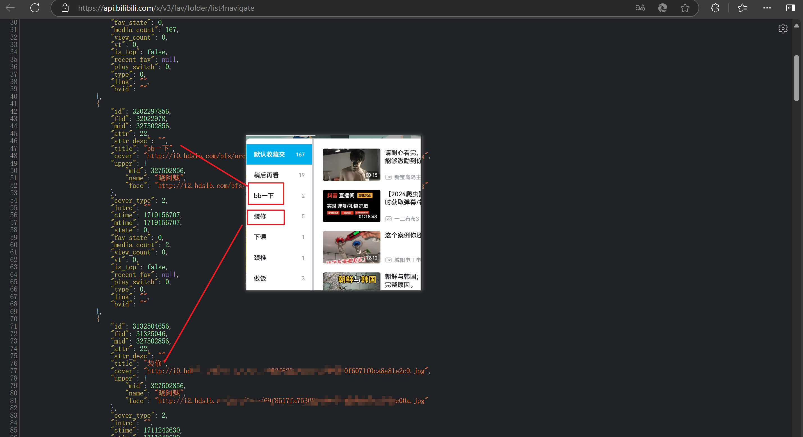
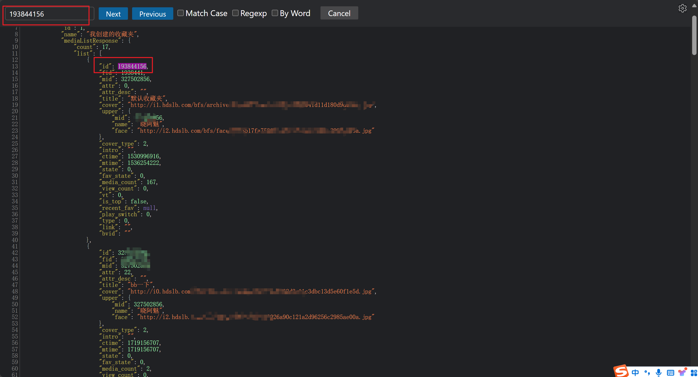
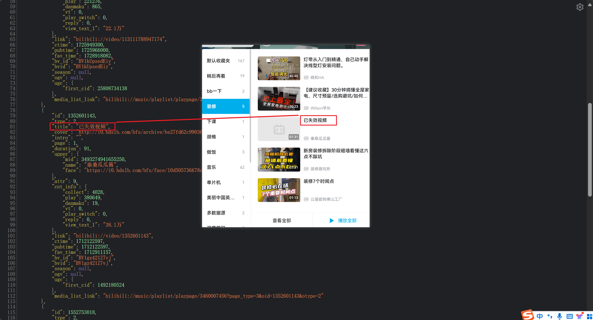
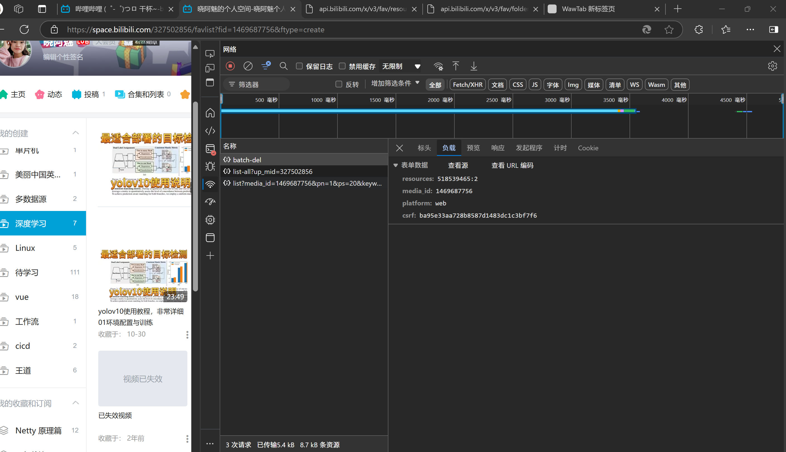
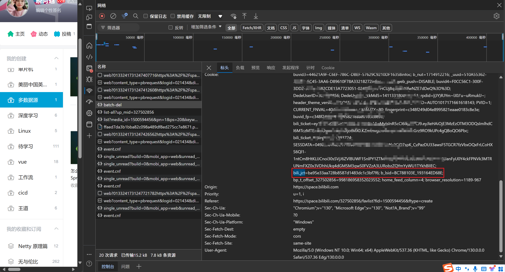

# 1 背景

收藏夹中存在少量失效视频，想要批量删除


# 2 接口分析

打开浏览器F12看网络发现两个接口，一个是查询所有收藏夹，一个是查询一个收藏夹下所有的视频


## 2.1 查询所有收藏夹接口
```shell
https://api.bilibili.com/x/v3/fav/folder/list4navigate
```



## 2.2 查询收藏夹下所有视频
```shell
https://api.bilibili.com/x/v3/fav/resource/list4navigate?platform=web&media_id=193844156
```
这里有个参数media_id=193844156，将这个数值放到，第一个接口响应结果里面去查询，发现就是收藏夹的ID



## 2.3 分析失效视频特征

特征为标题是失效视频



## 2.4 删除视频接口




接口类型 POST
```shell
https://api.bilibili.com/x/v3/fav/resource/batch-del
```
接口参数
```shell
resources: 518539465:2 -- 视频ID:视频类型
media_id: 1469687756 -- 收藏夹ID
platform: web -- 平台
csrf: ba95e33aa728b8587d1483dc1c3bf7f6 -- csrf
```

发现 csrf 为cookie中的bili_jct



# 3 程序设计

- 0 复制浏览器中的cookies
- 1 获取所有收藏夹ID
- 2 获取每个收藏夹下的失效视频ID以及类型
- 3 循环调用删除接口

# 4 程序实现

这里使用java语音配合hutool工具包快速实现

